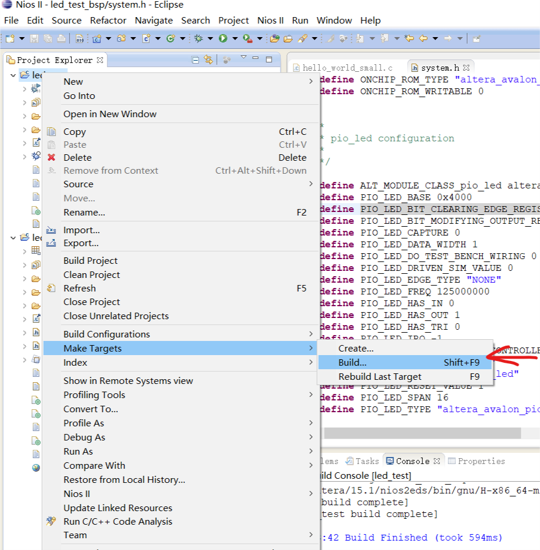

# Led test

## 重新生成BSP

在重新编译了quartus 工程后需要重新生成BSP 

Nios -> generate BSP

## small 模式的优化

在使用hello small 模板创建的工程使用的是面积优化

所以工具可能会优化掉我们的while()延时循环

关掉优化：off

## BSP 文件结构

to do 

## 如何快速调用qsys 中添加的组件

## BSP 中的system.h文件

system.h 中的宏定义与我们qsys 中设计的硬件信息是一 一对应的，比如#define PIO_LED_BASE 0x4000

## Nios 固化程序：

### 片上ROM生成ROM 初始化文件

生成的存储器初始化文件

将meminit.qip文件添加到quartus 工程中

然后重新全编译工程

生成的.sof文件就会包含这个rom的初始化文件。

如果想要固化程序只需要生成jic然后烧写进flash中即可。

## PIO 中的 inout 与Bidir

信号放到管脚上设置成bidir

信号在FPGA内部使用，使用inout ,信号在FPGA 内部不支持三态，只有在FPGA的管脚上才有三态。

## 下载程序

1. 先把sof文件下载到fpga 
2. 下载软件程序
   - 在工程中右键选择debug as -> debug configure -> NiosII Hardware
   
   - 
   
     

